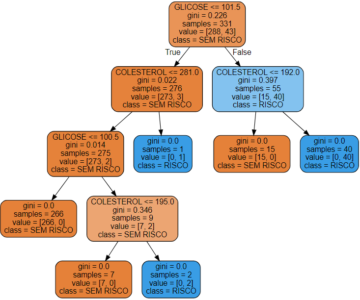

<!DOCTYPE html>
<html lang="en">
<head>
    <meta charset="UTF-8">
   
</head>
<body>

<h1>Análise de Risco de Saúde com Machine Learning</h1>

Este projeto tem como objetivo utilizar técnicas de machine learning para prever o risco de saúde com base em características físicas e biomédicas de indivíduos. A análise foi realizada utilizando Python e bibliotecas de machine learning como Scikit-learn.

<h2>Conteúdo</h2>

<ol>
    <li><a href="#descricao">Descrição do Projeto</a></li>
    <li><a href="#metodos">Métodos Utilizados</a></li>
    <li><a href="#resultados">Resultados</a></li>
    <li><a href="#como-usar">Como Usar</a></li>
    <li><a href="#contribuicao">Contribuição</a></li>
   
</ol>

<h2 id="descricao">Descrição do Projeto</h2>

O objetivo principal deste projeto é prever o risco de saúde com base em características físicas e biomédicas, como idade, IMC, níveis de glicose e colesterol. Foram utilizados diversos métodos de machine learning para criar modelos e avaliar sua performance na tarefa de classificação do risco de saúde.

<h2 id="metodos">Métodos Utilizados</h2>

<ul>
    <li><strong>LinearSVC:</strong> Utilizado como ponto de partida para entender a relação linear entre as features e o risco de saúde.</li>
    <li><strong>SVC com Padronização:</strong> Aplicação do Support Vector Classifier com padronização dos dados para melhorar a performance do modelo.</li>
    <li><strong>Árvore de Decisão:</strong> Utilizado para criar um modelo interpretável e identificar as características mais importantes na classificação de risco.</li>
</ul>

<h2 id="resultados">Resultados</h2>

Os resultados obtidos foram:

<ul>
    <li><strong>LinearSVC:</strong> Acurácia de 87.39%</li>
    <li><strong>SVC com Padronização:</strong> Acurácia de 96.40%</li>
    <li><strong>Árvore de Decisão:</strong> Acurácia de 99.10%</li>
</ul>

A árvore de decisão destacou que os níveis de <code>GLICOSE</code> e <code>COLESTEROL</code> são as principais features para a classificação de risco.

<h2 id="como-usar">Como Usar</h2>

<ol>
    <li>Clone o repositório:</li>
    <code>git clone https://github.com/SAraEmilay/Classifica-o-com-SKLearn-de-dados-de-diabetes.git</code
    <li>Execute o Jupyter Notebook ou o script Python para explorar e executar a análise.</li>
</ol>

<h2 id="contribuicao">Contribuição</h2>

Contribuições são bem-vindas! Sinta-se à vontade para abrir issues e pull requests para melhorar este projeto.

</body>
</html>
